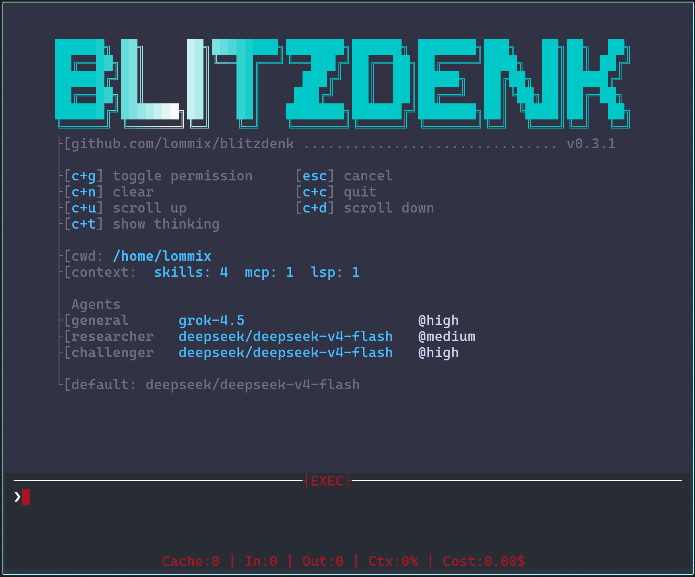

# Blitzdenk

Coding and research harness for posix systems. No dependencies, just Zig and vendored Lua.
Configure, override and extend in Lua.



## Core features and patterns

- All IO goes through GNU core utils (ls, tee, cat, etc.)
- Enables an invisible SSH layer that agents can pipe through.
- Small: 5MB native binary, less than 200MB ram usage.
- MCP, LSP and Skill support.
- Multi-provider: Any OpenAI or Anthropic chat schema supported. Includes local AI.
- Customize in Lua. Code your own tools, system prompts, modes, commands and loops.

## Install

You can download the pre compiled binaries from [the release page](https://github.com/Lommix/blitzdenk/releases) or build it yourself:

```
zig build --release=small
cp zig-out/bin/blitz ~/.local/bin/blitz
```

## Documentation

[checkout the examples](https://lommix.github.io/blitzdenk/)

[or my configuration](https://github.com/Lommix/dotfiles/blob/master/config/blitzdenk/blitz.lua).

## Contribution

No issue no merge. Open source, closed contribution. Simple bug fixes are welcome. In a world of slop, I don't have the time
to look at yours. This project is mostly hand coded. I find read only agents far more useful than code generation.
