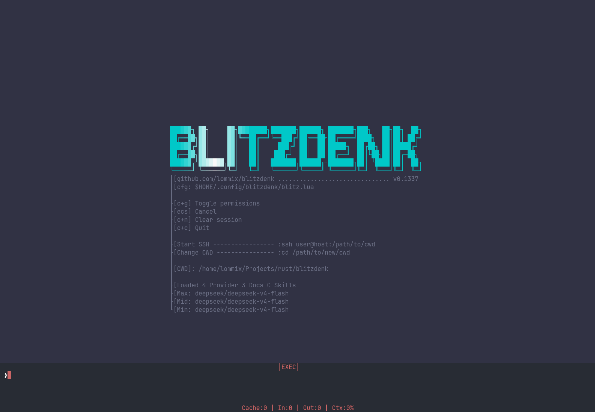

# Blitzdenk

Coding and research harness for posix systems. No dependencies, just Zig and vendored Lua.
Configure, override and extend in Lua.



## Core features and patterns

- All IO goes through GNU core utils (ls, tee, cat, etc.)
- Enables an invisible SSH layer that agents can pipe through.
- Small: 5MB native binary, less than 200MB ram usage.
- Doc Linking and Skill support.
- MCP support
- Multi-provider: Any OpenAI or Anthropic chat schema supported. Includes local AI.
- Customize in Lua. Code your own tools, system prompts, modes, commands and loops.

## Configuration in Lua

There are no official docs yet. Checkout the provided [lua meta file](./src/blitz_defs.lua) for all available bindings.

You can also look at [my configuration](https://github.com/Lommix/dotfiles/blob/master/config/blitzdenk/blitz.lua), which covers at least one example per use case.

## Install

You need the Zig 0.16 compiler.

```
zig build --release=small
cp zig-out/bin/blitz ~/.local/bin/blitz
```

## SSH mode

Enables ssh layer all agent commands are piped through

`:ssh username@host:/path/to/cwd`

You'd better know what you're doing. If you delete something important, let me know in an issue, so I may laugh at you.

## Neovim integration

Sometimes I just want quick Info about something on in my current file. For this I have the following Neovim bind:

```lua
vim.keymap.set("n", "<leader>o", function()
	local fname = vim.fn.expand("%:p")
	local lineno = vim.fn.line(".")
	vim.cmd('vsplit | terminal blitz prompt "' .. fname .. ":" .. lineno .. ' " --log')
end, { silent = true })
```

## Contribution

No Issue, no merge. Open source, but not open contribution. Too much slop, to little time to validate. Small bug fixes are welcome.

## Lua

Some simple configuration examples to inspire you:

```lua

local llama = blitz.add_provider({
	type = "openai",
	url = "http://127.0.0.1:8118",
	key_envar = "",
	max_tokens = 32000,
	reasoning = { effort = "high" },
	temperature = 1,
})

local local_model = "gemma-4-12b-it"
blitz.set_model("max", local_model, llama)
blitz.set_model("mid", local_model, llama)
blitz.set_model("min", local_model, llama)
blitz.set_compact_edge(128000)


-- custom tool example
blitz.register_tool({
	name = "lua_repl",
	description = "Execute arbitrary Lua code and return the result. Use this tool for any math calculations",
	args = {
		code = { type = "string", description = "Lua code to execute", required = true },
	},
	func = function(ctx, call)
		ctx:set_status("(Lua) `" .. call.arguments.code .. "`")

		local fn, err = load(call.arguments.code)
		if not fn then
			return blitz.err(err)
		end

		local ok, result = pcall(fn)
		if not ok then
			return blitz.err(tostring(result))
		end

		return blitz.ok(tostring(result or "nil"))
	end,
})

-- MCP configuration and activation

local is_active = false

local playmcp = blitz.mcp.add({
	name = "playwright",
	command = "npx",
	args = {
		"-y",
		"@playwright/mcp@latest",
		"--browser=chromium",
		"--executable-path=/usr/bin/chromium",
	},
	tools_prefix = "pw_",
})


blitz.add_command(":browser", function()
	if is_active == true then
		return
	end

	blitz.push_notification("Playwright MCP enabled!")
	blitz.mcp.enable(playmcp, blitz.AGENT_MAIN)
	is_active = true
end)

```
