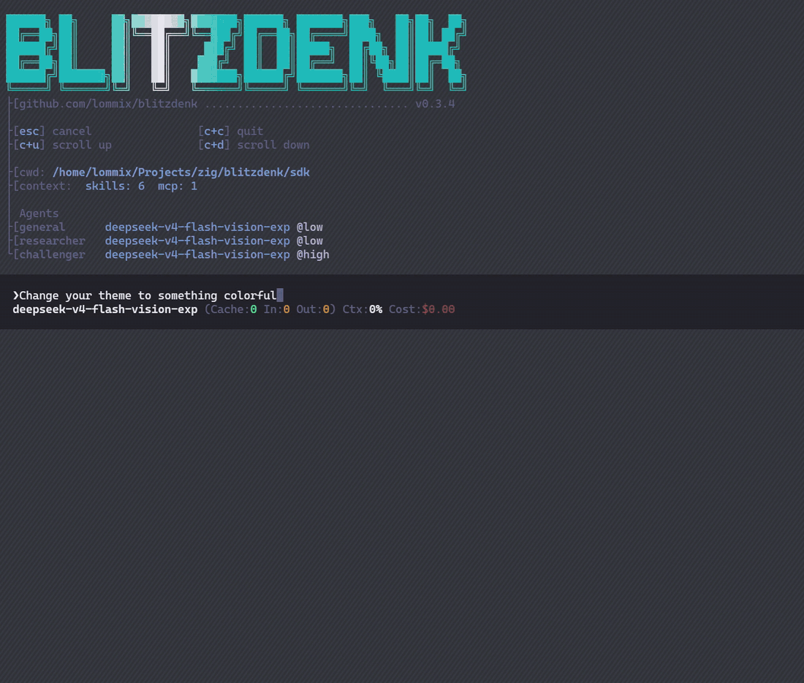

# Blitzdenk

Universal Coding harness for posix. No deps, no chain, vendored Lua.
This coding-agent molds itself around your requirements by extending its Lua sandbox exactly the way you need it.



## Core features and patterns

- All IO goes through GNU core utils (ls, tee, cat, etc.)
- Optional SSH tunnel layer: seamless remote tool execution.
- MCP and Skill support.
- Multi-provider: Any OpenAI or Anthropic chat/response schema supported, including local AI.
- Mermaid diagram render in tui.
- Lua hot reload
    - Agents can code tools and debug them at the same time.
    - Global or project local. Mold the tool to your needs.
- version management. Simply run `blitz update` on new releases.

## Defaults

The default config comes with some useful commands for quick testing.

- `/plan <prompt>`: Plan with the agent - based on grill-me skill
- `/review <?prompt>`: Launch multiple challenger agents to review what was done.
- `/team <?prompt>`: Multiagent orchestrator mode
- `/show <?prompt>`: explain something with mermaid diagrams
- `/ssh-<myconfig>..`: autocomplete your ssh config entries for quick connection.

Connect remote without ssh config entries `/ssh user@host:/path/to/cwd`

## Install

One line, no sudo. Installs to `~/.local/bin/blitz`

```
curl -fsSL https://raw.githubusercontent.com/Lommix/blitzdenk/main/install.sh | sh
```

You can also download the pre compiled binaries by hand on [the release page](https://github.com/Lommix/blitzdenk/releases)

build yourself:

```
zig build --release=small
cp zig-out/bin/blitz ~/.local/bin/blitz
```

## Minimal configuration

Open the blitz.lua configuration at `~/.config/blitzdenk/blitz.lua`
Setup at least on provider. The **key_envar** is not the API key! It's the environment var holding your key.

```lua
local opencode = blitz.add_provider({
	type = "openai", -- "response" | "anthropic"
	url = "https://opencode.ai/zen/go/v1",
	key_envar = "OPENCODE_API_KEY",
})

local opencode_ds_flash = blitz.add_model({
	name = "deepseek-v4-flash",
	provider = opencode,
	cost = { input = 0.14, output = 0.28, cache = 0.028 },
})

blitz.set_model_agent(blitz.AGENT_GENERAL, opencode_ds_flash, "max")
```

## Documentation

Ask the agent, once the provider is set up. The `blitzdenk-lua.md` skill contains all information required.
[or take a look at my configuration](https://github.com/Lommix/dotfiles/blob/master/config/blitzdenk/blitz.lua).

## Contribution

No issue no merge. Open source, restricted contribution. Simple bug fixes are welcome.
