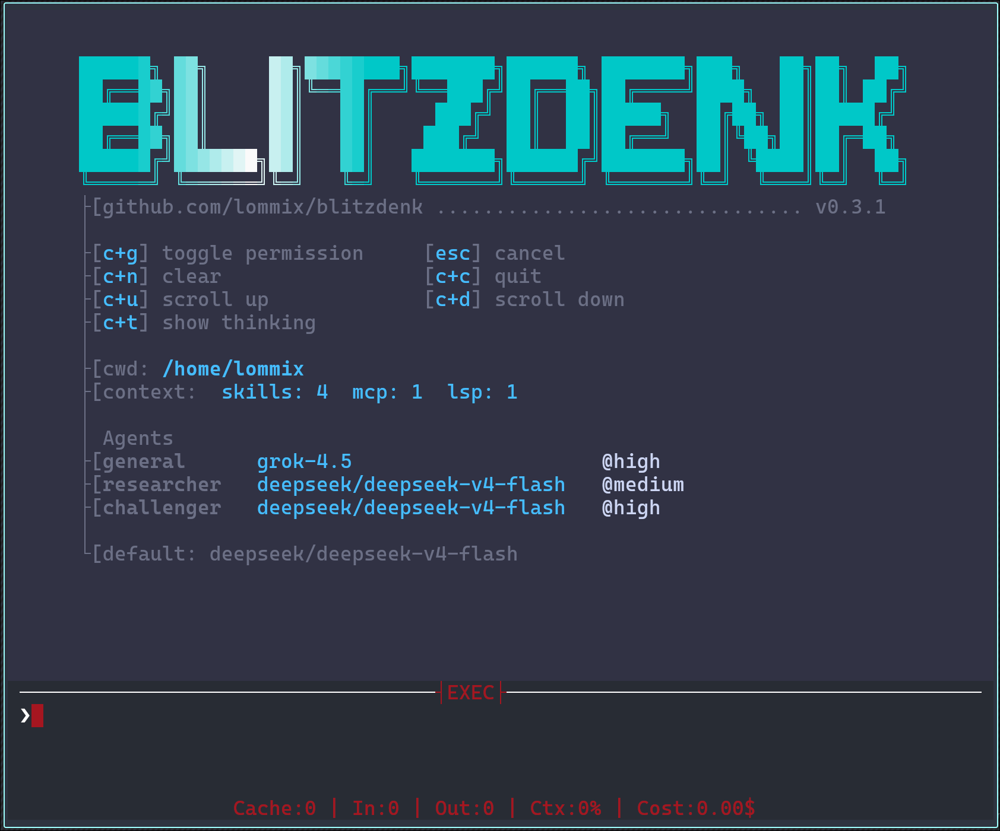

# Blitzdenk

Universal Coding harness for posix. No deps, no chain, vendored Lua.
Extend in Lua with hot reload. Let the harness code itself.

**_[WIP]: The harness is fine tuned on deepseek-v4-flash, Lua-Api may change/still unfinished _**



## Core features and patterns

- All IO goes through GNU core utils (ls, tee, cat, etc.)
- Optional SSH layer: Execute remote.
- MCP and Skill support.
- Multi-provider: Any OpenAI or Anthropic chat/response schema supported, including local AI.
- Mermaid diagram render in tui.
- Lua hot reload. Agents can code tools and debug them at the same time.

## Defaults

The default config comes with some useful commands for quick testing

- `/plan <prompt>`: Plan with the agent - based on grill-me skill
- `/review <?prompt>`: Launch multiple challenger agents to review what was done.
- `/team <?prompt>`: Multiagent orchestrator mode
- `/show <?prompt>`: explain something with mermaid diagrams

## Install

You can download the pre compiled binaries from [the release page](https://github.com/Lommix/blitzdenk/releases) or build it yourself:

```
zig build --release=small
cp zig-out/bin/blitz ~/.local/bin/blitz
```

## Minimal configuration

Open the blitz.lua configuration at `~/.config/blitzdenk/blitz.lua`
Setup at least on provider. The **key_envar** is not the API key! It's the environment var holding your key.

```lua
local anthropic = blitz.add_provider({
	type = "anthropic",
	url = "https://api.anthropic.com/v1/",
	key_envar = "CLAUDE_API_KEY",
	max_tokens = 32000,
	temperature = 1,
})

local llama = blitz.add_provider({
	type = "openai",
	url = "http://127.0.0.1:8118",
	key_envar = "",
	max_tokens = 32000,
})

local novita = blitz.add_provider({
	type = "openai",
	url = "https://api.novita.ai/openai/v1",
	key_envar = "NOVITA_API_KEY",
	temperature = 1,
	max_tokens = 32000,
})

local openrouter = blitz.add_provider({
	type = "openai",
	url = "https://openrouter.ai/api/v1",
	key_envar = "OPENROUTER_API_KEY",
	temperature = 1,
	max_tokens = 32000,
})

local xai = blitz.add_provider({
	type = "response",
	url = "https://api.x.ai/v1",
	key_envar = "XAI_API_KEY",
	temperature = 1,
	max_tokens = 32000,
})

local openai = blitz.add_provider({
	type = "response",
	url = "https://api.openai.com/v1",
	key_envar = "OPENAI_API_KEY",
	max_tokens = 32000,
})
```

Then bind a model to each agent

```lua
local ds_flash = blitz.add_model({
	name = "deepseek/deepseek-v4-flash-0731",
	provider = novita,
	cost = { input = 0.14, output = 0.28, cache = 0.028 },
})
blitz.set_model_agent(blitz.AGENT_GENERAL, ds_flash, "max")
```

## Documentation

Ask the agent, once the provider is set up. The `blitzdenk-lua.md` skill contains all information required.
[or take a look at my configuration](https://github.com/Lommix/dotfiles/blob/master/config/blitzdenk/blitz.lua).

## Contribution

No issue no merge. Open source, restricted contribution. Simple bug fixes are welcome.
