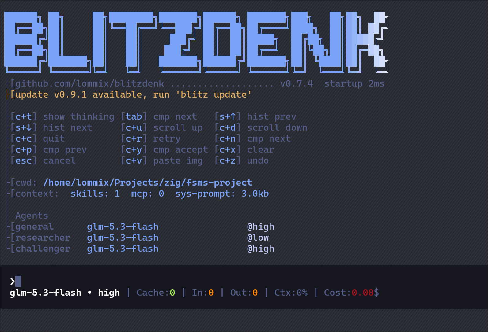

# Blitzdenk

A minimal self improving coding harness for POSIX. No dependencies, vendored Lua.
Ships as a single <2MB binary using less then 99MB of ram.

> Goal: Becoming the Neovim of harnesses



```shell
curl -fsSL https://raw.githubusercontent.com/Lommix/blitzdenk/master/install.sh | sh
```

## Core features and patterns

- Tiny system prompt, minimal tool descriptions. Simple is efficient.
- All IO goes through GNU core utils (ls, tee, cat, etc.)
- Optional SSH tunnel layer. Tools run on a remote host.
- MCP and Skill support.
- Multi-provider: any OpenAI or Anthropic chat/response schema supported, including local AI.
- Mermaid diagram render in tui.
- Hot reload: Agents can extend themself and debug what at the same time.
- Version management: run `blitz update` on new releases. (pulls release bin from github)
- Sessions management per project: `blitz continue <?session_id>` resumes, `blitz sessions` list all
- Render custom widgets from Lua

## Defaults

On first install, we include a solid foundation configuration with some popular Commands, sub agent
tooling and more. You can delete, overwrite or extend anything!

- `/plan <prompt>`: Plan with the agent - based on grill-me skill
- `/review <?prompt>`: Launch multiple challenger agents to review what was done.
- `/team <?prompt>`: Multiagent orchestrator mode `Ultramode`
- `/show <?prompt>`: explain something with mermaid diagrams
- `/ssh-<myconfig>..`: autocomplete your ssh config entries for quick connection.
- `/improve <?prompt>`: Review the conversation/task and start improving the harness.

Connect remote without ssh config entries `/ssh user@host:/path/to/cwd`

## Build

You can also download the pre compiled binaries for your system on [the release page](https://github.com/Lommix/blitzdenk/releases)
or build yourself:

```
zig build --release=small
cp zig-out/bin/blitz ~/.local/bin/blitz
```

## Minimal configuration

Open the blitz.lua configuration at `~/.config/blitzdenk/blitz.lua` or in pwd `./blitz.lua`
Setup at least on provider. The **key_envar** is not the API key! It's the environment var holding your key.

```lua
local opencode = blitz.add_provider({
	type = "openai",
	url = "https://opencode.ai/zen/go/v1",
	key_envar = "OPENCODE_API_KEY",
	session_key_header = "x-opencode-session",
    -- key = "..." -- or
})

local opencode_ds_flash = blitz.add_model({
	name = "deepseek-flash",
	provider = opencode,
	vision = true,
	cost = { input = 0.15, output = 0.6, cache = 0.006 },
})

blitz.set_agent_model(blitz.AGENT_GENERAL, opencode_ds_flash, "high")
```

## Documentation

Ask the agent, once the provider is set up. The `blitzdenk-lua.md` skill contains all information required.
[or take a look at my configuration](https://github.com/Lommix/dotfiles/blob/master/config/blitzdenk/blitz.lua).
